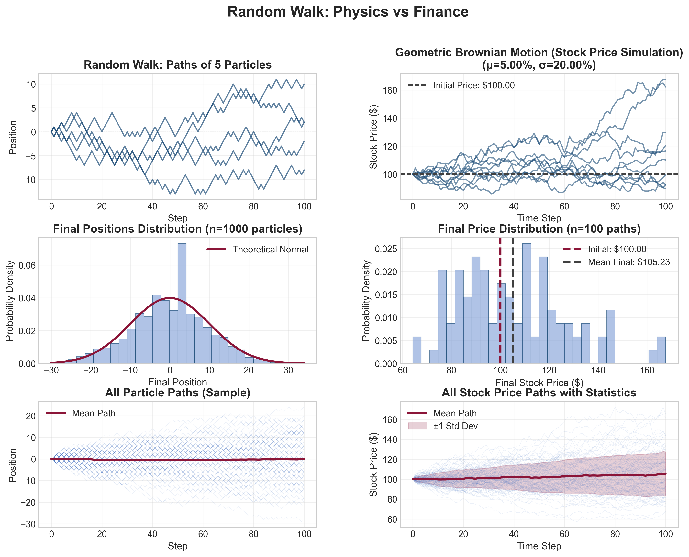

# The Physics of Finance: Diffusion & Volatility Modeling

## Why I Built This

As a Physics and Mathematics student, I was interested in how the laws of nature, like the random walk of a particle, can explain the seemingly chaotic and artificial movements of global markets. This project is a technical "deep dive" into financial volatility viewed through a physics lens, demonstrating that stock price uncertainty is in reality a measurable physical phenomenon.

- **Key Finding**: During this simulation, I mathematically verified that the Particle Std Ratio (0.988) and the Stock Vol Ratio (0.997) converge almost perfectly to their theoretical values. This proves that stock prices follow the exact same $\sqrt{n}$ law as a diffusing molecule in a laboratory.

## The Analogy: Physics vs. Finance

This project bridges the gap between Simple Random Walks and Geometric Brownian Motion (GBM).

| Feature | Physics (Diffusion) | Finance (Volatility) |
|---------|---------------------|----------------------|
| Variable | Particle Position ($x$) | Stock Price ($S$) |
| Driver | Random Step ($\pm 1$) | Random Return ($\epsilon$) |
| Scale | Diffusion Coefficient ($D$) | Volatility ($\sigma$) |
| External Force | Gravity / Field | Drift / Expected Return ($\mu$) |
| Spread Over Time | Std Dev $\propto \sqrt{t}$ | Volatility $\propto \sqrt{t}$ |

## Mathematical Foundation

### 1. The Physics: Random Walk

In a 1D random walk, a particle moves with equal probability $p=0.5$. After $n$ steps, the Central Limit Theorem dictates that the distribution of positions converges to a Normal Distribution.

- Mean position: $0$
- Standard Deviation: $\sigma = \sqrt{n}$

### 2. The Finance: Geometric Brownian Motion

Stock prices are modeled as a stochastic process where the logarithm of the price follows a random walk with drift. The simulation uses the following closed-form solution for GBM:

$$S_{t+dt} = S_t \exp\left(\left(\mu - \frac{\sigma^2}{2}\right)dt + \sigma\sqrt{dt}\epsilon\right)$$

Where:

- $\mu$: Annualized drift (expected return)
- $\sigma$: Annualized volatility
- $dt$: Time increment
- $\epsilon$: Random variable sampled from $\mathcal{N}(0,1)$

## Visualizing the Convergence

The script generates a side-by-side comparison of the two systems.



- **Left Column**: Visualizes particle diffusion, showing how a cloud of 1,000 particles spreads over time following the $\sqrt{n}$ rule.
- **Right Column**: Visualizes 100 simulated stock paths, showing how price "uncertainty" widens in the exact same mathematical pattern.

## Installation & Usage

### Requirements

- Python 3.7+
- numpy (Vectorized Monte Carlo simulations)
- matplotlib (Data visualization)

### Quick Start

```bash
# Clone the repository
git clone https://github.com/jujulefox/physics-of-finance.git

# Install dependencies
pip install numpy matplotlib

# Run the simulation
python diffusion_volatility.py
```

## Insights for Quants

- **Vectorization**: The simulation avoids slow Python loops, using NumPy's broadcasting to simulate thousands of paths simultaneously, mimicking production-level Monte Carlo performance.
- **The "Itô" Term**: The inclusion of $-\frac{1}{2}\sigma^2$ in the GBM formula accounts for the difference between the median and mean of a log-normal distribution (important in derivative pricing). 

## Author

**Juliette Renard** – Physics/Math Student & Aspiring Quantitative Researcher. This project is part of my technical portfolio for 2026 internship applications.

## License

MIT License. For educational and demonstrative purposes.

